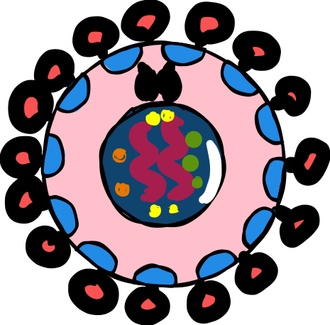

<p align="center">
  
</p>

<h1 align="center">Nyx Threat Scanner v1.1</h1>

<p align="center">
  <strong>Created by: Saeed Elfiky</strong>
</p>

<p align="center">
  
  
  
</p>

Nyx is a high-performance, private-first Anti-Virus and Threat Intelligence Scanner built from scratch in Python. It provides multilayered security by combining static signature matching, dynamic heuristic analysis, and deep-level PE file inspection without ever needing an internet connection.

---

## Features

*   **Nyx Guardian (Real-Time Protection):** Actively monitors your directories (Desktop, Downloads, etc.) in real-time using built-in file system watchers. It catches and quarantines threats as soon as they land on your drive.
*   **Deep PE Inspection:** Analyzes Windows .exe and .dll structure for entropy (detecting packed/compressed malware) and suspicious DLL import hashing.
*   **Air-Gapped Scanning:** 100% private. All scanning occurs locally on your machine with zero external API calls or cloud dependencies.
*   **Persistent Event Logging:** Tracks all scan history, threat findings, and quarantine actions in a secure, local nyx_scan_history.log file.
*   **Automated Quarantine:** Safely isolates and segregates malicious files by timestamping and renaming them to prevent accidental execution.

---

## Installation & Setup

1. **Clone the Repository**
   ```bash
   git clone https://github.com/saeed8elfiky/Nyx.git
   cd Nyx
   ```

2. **Install Dependencies**
   ```bash
   pip install watchdog pefile
   ```

---

## Usage

### Manual Scanning
Scan a folder or file recursively for immediate threats:
```powershell
python antivirus.py "C:\Users\Saeed\Downloads" -q
```

### Guardian Mode (Real-Time Protection)
Keep Nyx running in the background to monitor your system live:
```powershell
python antivirus.py "C:\Users\Saeed\Desktop" -w -q
```

---

## Database Structure (signatures.json)

Nyx uses a highly accessible JSON format for its signature database.

```json
{
    "hashes": {
        "44d88612fea8a8f36de82e1278abb02f": {
            "name": "EICAR-Test-File",
            "type": "test_virus"
        }
    },
    "heuristics": [
        {
            "name": "Suspicious_PHP_Eval",
            "pattern": "eval\\s*\\(\\s*base64_decode\\s*\\(",
            "type": "webshell",
            "severity": "high"
        }
    ]
}
```

---

## Disclaimer

**Nyx is intended for ethical security research and educational use.** While extremely powerful at static and heuristic detection, it should be used in conjunction with OS-level defenses for full system protection. Use with caution on production systems.
